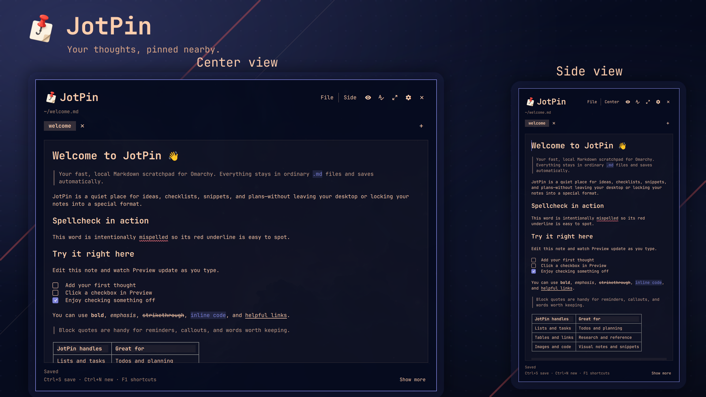

# JotPin



JotPin is a small Markdown scratchpad that runs inside the Omarchy shell. It
defaults to the `Side` presentation, a right-anchored floating drawer, keeps
notes as plain `.md` files, and autosaves edits.

## Contents

| Get started | Project guides |
| --- | --- |
| [Features](#features) | [Portability and future shells](#portability-and-future-shells) |
| [Requirements](#requirements-and-external-dependencies) | [Validate locally](#validate-locally) |
| [Install or remove](#install-and-remove-with-omarchy) | [Developer deployment](#developer-deployment-from-a-local-checkout) |
| [Supported code languages](#supported-fenced-code-languages) | [Data and settings](#data-and-settings) |
| [Using JotPin](#using-jotpin) | [Default keyboard shortcuts](#default-keyboard-shortcuts) |
| [Repository layout](#repository-layout) | [Development loop](#development-loop) |
| [License](#license) | |

## Features

### Markdown editing

- Edit rendered Markdown directly in `Preview`, or switch to `Raw` whenever
  you want the complete source. Both views save the original Markdown rather
  than generated HTML.
- Render CommonMark and GFM headings, emphasis, links, quotes, lists, task
  lists, tables, images, thematic breaks, inline code, and fenced code while
  preserving source-mapped caret and selection behavior.
- Toggle a task by clicking its checkbox in Preview or pressing `Ctrl+Enter`
  on its source row.
- Use the contextual table controls to insert or remove rows and columns,
  repair malformed tables without dropping cell text, or delete a table as one
  undoable edit.
- Resize standalone Preview images from any corner without changing their
  aspect ratio. Relative image paths resolve from the active note, and failed
  images remain visible as editable text instead of disappearing.
- Highlight fenced code locally with 31 bundled grammars, including Dart; the
  complete canonical names and accepted aliases are listed under
  [Supported fenced-code languages](#supported-fenced-code-languages).
  Unknown languages remain readable as plain code.
- Auto-pair triple-backtick fenced-code closers, common brackets and quotes,
  and HTML/XML-style tags in matching code blocks. The editable language header
  and trailing escape line stay reachable from the keyboard.
- Check English (US) spelling locally in Preview and Raw, apply right-click
  corrections, ignore a word for the session, or add it to a persistent
  personal dictionary. Code, URLs, paths, tags, and other technical tokens are
  skipped.
- Find literal text with an optional `Match case` toggle, replace one or every
  match, move between matches with `F3` / `Shift+F3`, and jump to a source line
  with `Ctrl+G`.
- Keep familiar editor behavior: mouse selection, word wrapping, clipboard
  commands, `Tab` / `Shift+Tab` indentation, a keyboard-accessible context
  menu, and per-note undo/redo with `Ctrl+Z`, `Ctrl+Y`, or `Ctrl+Shift+Z`.

### Supported fenced-code languages

Put a canonical name or alias immediately after the opening fence:

~~~~markdown
```dart
void main() => print('Hello');
```
~~~~

Names are case-insensitive; only the first whitespace-delimited token is used.
`none`, `plain`, `text`, and `txt` deliberately select uncolored plain code.

| Language | Canonical fence name | Accepted aliases |
| --- | --- | --- |
| Bash | `bash` | `fish`, `shell`, `sh`, `zsh` |
| C | `c` | — |
| C++ | `cpp` | `c++`, `h`, `h++` |
| C# | `csharp` | `c#`, `cs` |
| Clojure | `clojure` | — |
| CSS | `css` | — |
| Dart | `dart` | — |
| GDScript | `gdscript` | `gd` |
| Go | `go` | `golang` |
| GraphQL | `graphql` | — |
| Java | `java` | — |
| JavaScript | `javascript` | `js`, `jsx` |
| JSON | `json` | `jsonc` |
| Kotlin | `kotlin` | `kt` |
| Lua | `lua` | — |
| Markdown | `markdown` | `md` |
| Objective-C | `objectivec` | `objective-c`, `objc` |
| Perl | `perl` | — |
| PHP | `php` | — |
| PowerShell | `powershell` | `ps` |
| Python | `python` | `py` |
| QML | `qml` | — |
| R | `r` | — |
| Ruby | `ruby` | `rb` |
| Rust | `rust` | `rs` |
| SCSS | `scss` | — |
| SQL | `sql` | — |
| Swift | `swift` | — |
| TypeScript | `typescript` | `ts`, `tsx` |
| XML | `xml` | `html`, `svg` |
| YAML | `yaml` | `yml` |

This is the complete curated set registered by `SyntaxHighlight.js` and the
bundled Highlight.js worker. A leading dot is also ignored, so `.dart` resolves
to `dart`.

### Notes and recovery

- Create, open, reopen from `Recent Files`, save, and `Save As` ordinary `.md`
  files from the grouped `File` menu. Non-Markdown extensions are rejected.
- Work across a horizontally scrollable tab strip with one to five configured
  rows. Tab labels hide `.md`, and a double-click or `F2` renames the filename
  stem without replacing an existing file.
- Restore the active note, open tabs, newly created notes, presentation, and
  settings after the panel or shell restarts.
- Autosave after 1.5 seconds of inactivity, save immediately with `Ctrl+S`,
  and keep atomic recovery snapshots during continuous editing. A surviving
  snapshot is offered with explicit `Recover` and `Discard` choices.
- Detect changes made to an open note by another program. Clean notes reload
  automatically; a note with local edits offers `Keep Mine` or
  `Reload disk version` instead of silently overwriting either copy. If the
  file was deleted, JotPin offers `Recreate with mine` instead of reload.
- Remove an untouched generated `untitled-XXXXXX.md` file when its tab closes.
  Closing the last tab first opens a fresh blank note so JotPin is always ready.

### Presentations and desktop integration

- Switch between a centered native window and a left- or right-anchored Side
  drawer without creating a second editor or losing caret, selection, undo, or
  scroll state.
- Resize the centered window normally or drag the Side drawer's exposed outer
  edge horizontally. JotPin's `Full Screen` action provides a maximized,
  full-width work-area view while keeping the Omarchy bar visible.
- Let Hyprland manage both native windows, so compositor fullscreen, maximize,
  move, resize, and restore controls continue to work.
- Configure the default notes folder, Side edge, file-tab row count, and JotPin
  command shortcuts. Header controls toggle Preview, spellcheck, presentation,
  Full Screen, and settings; the footer's `Show more` control or `F1` opens the
  complete shortcut card.
- Optionally add JotPin—with its real application icon—to the provider-backed
  Apps list, the full Omarchy menu, and a workspace-aware `SUPER + N` toggle.
  The guarded installer preserves unrelated menu entries and refuses to take
  an occupied binding.
- Summon an absolute or `~/` Markdown path and choose `side` or `window` from a
  JSON payload; an open JotPin can be moved to the visible normal or special
  workspace without duplicating its editor.

## Portability and future shells

Omarchy is the only supported JotPin host today. If enough users want it, we
plan to support other Hyprland/Quickshell environments, including
[DankMaterialShell](https://github.com/AvengeMedia/DankMaterialShell). This is
a roadmap direction, not a claim that those environments work today.

The editor, Markdown renderer, source mapping, persistence, and offline workers
remain shared runtime code. Shell lifecycle, bar, and screensaver state pass
through the injectable `HostIntegration.qml` contract. Hyprland workspace
events, window dispatches, Omarchy theme controls, and presentation behavior
remain explicit port boundaries in `JotPin.qml`; they have not been abstracted
or copied into speculative environment folders. See
[`PORTING.md`](PORTING.md) for the contract and acceptance checklist.

## Requirements and external dependencies

JotPin has no network service or account dependency. Its runtime dependencies
are:

- Omarchy with Quickshell shell-plugin support, including the packaged
  `qs.Commons` and `qs.Ui` QML modules;
- GNU coreutils (`ln`, `mkdir`, `mktemp`, `mv`, `rm`, and `test`) and GNU
  findutils (`find`) for local note and directory operations.

On Omarchy, Quickshell and the command-line utilities are system components.
JotPin includes its English (US) spelling dictionary, bundled JotPin/Omarchy
and desktop-development vocabulary, and curated fenced-code language
definitions, so users do not need to install a dictionary, spellcheck service,
Node.js package, or KDE syntax-highlighting package. Both features run locally
and offline in background workers.

Development and test dependencies are documented separately in
[`tests/README.md`](tests/README.md); they are not required for normal use.
The bundled language tools and named-character-reference table are documented
in
[`THIRD_PARTY_NOTICES.md`](THIRD_PARTY_NOTICES.md).

## License

For development and pull requests, see [Contributing](CONTRIBUTING.md).
Maintainers can find CI, dependency, review, and release procedures in
[Maintaining JotPin](docs/maintenance.md). See [Security](SECURITY.md) for
vulnerability reporting and [Changelog](CHANGELOG.md) for planned changes.

Copyright (c) 2026 JotPin contributors.

JotPin is released under the [GNU General Public License, version 3 only](LICENSE)
(`GPL-3.0-only`). You may redistribute and modify it under those terms.
It is provided without any warranty; see the license for details.

Bundled third-party components retain their own licenses and copyright notices;
see [THIRD_PARTY_NOTICES.md](THIRD_PARTY_NOTICES.md).

## Install and remove with Omarchy

While this repository is private, install it through an SSH identity that has
access:

```bash
omarchy plugin add git@github.com:l1qu1d/jotpin.git --enable
```

Its manifest installs the plugin as `dev.jotpin`.
The standard Omarchy installer clones and validates the plugin; it does not run
`install_safe.sh`, create the guarded installer's welcome note, or modify
Hyprland, menu, desktop-entry, icon, or keybinding configuration. Remove the
plugin with:

```bash
omarchy plugin remove dev.jotpin
```

Removal leaves the user's Markdown notes and JotPin state in place. If the
optional configuration integration described below was explicitly installed,
remove whichever `require("hypr.jotpin...")` lines it added and its JotPin menu
row, then delete `~/.config/hypr/jotpin.lua`,
`~/.config/hypr/jotpin_binding.lua`,
`~/.local/share/applications/dev.jotpin.desktop`, and
`~/.local/share/icons/hicolor/256x256/apps/dev.jotpin.png`. Those user-owned
files are never removed automatically.

On the first guarded deployment, the installer creates
`~/Documents/Notes/welcome.md` with a short Markdown introduction, feature
sampler, and essential shortcuts if that path is absent; an existing file is
left unchanged. With fresh JotPin state, that default path opens as the initial
tab. Users can edit or delete it, and upgrades never replace or recreate it.

### Open JotPin

We recommend `SUPER + N` as a convenient default keyboard shortcut for JotPin.
The optional integration below checks Omarchy's complete effective keybinding
list before installing it. If `SUPER + N` is already assigned—or if the check
cannot be completed—JotPin never unbinds or replaces it, and the existing
shortcut remains unchanged.

The same integration makes JotPin available through Omarchy's native Apps
menu: press `SUPER + A`, search for `JotPin`, and select the result with its
JotPin icon. It also adds `Personal > JotPin` to the full Omarchy menu opened
with `SUPER + SHIFT + A`.

## Validate locally

From this directory:

```bash
bash tests/run.sh
```

The default runner is the full headless, non-interactive suite: it exercises
the pure editor and spellcheck models, validates the plugin and guarded
installer, verifies the complete persistence lifecycle against temporary
files, and runs the production parser, renderer, caret, pointer, parity, and
performance gates in offscreen Quickshell processes. It does not open JotPin
or control the desktop.

Pass one of these modes when a narrower or interactive check is appropriate:

| Mode | Coverage |
| --- | --- |
| `model` | Pure editor-transition tests only. |
| `performance` | Production Markdown parser/display latency smoke. |
| `render` | Production parser, RichText display, caret matrix, pointer, and parity checks. |
| `headless` | Every non-interactive plugin, installer, parser, renderer, performance, and persistence check; this is the default. |
| `legacy-render` | Retired pure-QML renderer oracle, for historical comparison rather than production acceptance. |
| `legacy-performance` | Retired pure-QML renderer benchmark, also not a production acceptance gate. |
| `window` | Opt-in native-window placement, Full Screen, compositor fullscreen/maximize/restore, and resize regression. |
| `live` | Opt-in visual smoke test that controls the active desktop. |
| `all` | Headless checks, followed by both interactive suites only when `JOTPIN_ALLOW_LIVE_TESTS=1` is set. |

The compatibility aliases `perf`, `isolated`, `fast`, and `visual` map to
`performance`, `render`, `headless`, and `live`, respectively.

To save a representative production-renderer PNG for visual inspection without
opening JotPin, run:

```bash
bash tests/native_markdown_visual.sh
```

Live tests are intentionally opt-in because they summon the plugin, inject
keyboard input into the focused Wayland surface, and capture the screen. Run
the visual smoke test only when the desktop can be interrupted:

```bash
JOTPIN_ALLOW_LIVE_TESTS=1 bash tests/run.sh live
```

Native compositor lifecycle checks are opt-in as well:

```bash
JOTPIN_ALLOW_LIVE_TESTS=1 bash tests/run.sh window
```

The headless suite statically checks both native presentations, their map-time
rules, theme-scaled geometry, and the Side resize wiring. The opt-in `window`
mode supplies the real compositor evidence for placement, centered size, JotPin
Full Screen, compositor fullscreen/maximize/restore, and horizontal-only Side
resizing. It is separate because it controls the active compositor.

The QML entry point is `JotPin.qml`, the production display component is
`NativeMarkdownDisplay.qml`, and the manifest id is `dev.jotpin`. A bundled
micromark/mdast worker parses CommonMark and GFM into sanitized, Qt-compatible
HTML with canonical source ranges; Qt's native rich-text document performs the
visible layout. `MarkdownDisplay.qml` remains only as a historical visual and
performance oracle for maintainers. The live caret uses the same parsed source
revision and native document layout as the visible Markdown. Rendered
behavior is gated by an 88-case parity suite containing all 76 fixtures ported
from the retired renderer plus focused caret, blank-row, list-wrapping, and
list-continuation regressions, including source-mapped clicks, selections,
tables, images, lists, quotes, and fenced-code language labels. Private
implementation assertions from the retired renderer are not carried forward.
The committed Markdown parser worker is generated by
`scripts/build_markdown_bundle.mjs`; the Highlight.js and nspell workers are
generated by `scripts/build_vendor_bundles.mjs`. Exact pinned versions are
recorded in [`vendor/VERSIONS.json`](vendor/VERSIONS.json), with license details
in [`THIRD_PARTY_NOTICES.md`](THIRD_PARTY_NOTICES.md). Normal users do not need
Node.js or npm.
Unknown language tokens remain plain code. An unclosed fence renders as code
through the end of the note; typing an opening triple-backtick fence
automatically inserts its closer. The same generated bundle includes `nspell`
and the English (US) dictionary used by the local spellcheck worker.

The live smoke test uses disposable fixture copies, captures the Side drawer,
centered window, and formatted-caret positions, and verifies that the fixtures
were not modified. See [`tests/README.md`](tests/README.md) for its complete
coverage, artifacts, dependencies, and safety boundary.

## Developer deployment from a local checkout

For a disposable local-clone installation, let Omarchy clone this checkout:

```bash
omarchy plugin add "$PWD" --enable
```

JotPin is on-demand and is deliberately not kept loaded as part of the
persistent shell process. Repository developers can instead use the guarded
deployment script below. It refuses to write while Quickshell is running
because a file write triggers an immediate shell reload.

The guarded developer deployment additionally requires Bash, `omarchy-shell`,
`pgrep`, and GNU coreutils. The optional configuration
integration also requires `omarchy`, ripgrep, Perl, and `luac`.

```bash
JOTPIN_ALLOW_DEPLOY=1 bash install_safe.sh
```

The default deployment updates the managed plugin directory and creates a
deployment-backup directory. On the first guarded deployment only, it also
creates the welcome note if that path does not already exist. Without the
configuration-consent flag it leaves Hyprland, menu, desktop-entry, icon, and
keybinding configuration unchanged. The installer checks both the shell IPC
endpoint and the local Quickshell process list, and never runs `rescanPlugins`
or restarts the shell itself.

The optional desktop-app, floating-window, menu, and keybinding integration
changes user-owned configuration and therefore requires a second, explicit
consent flag:

```bash
JOTPIN_ALLOW_DEPLOY=1 JOTPIN_ALLOW_CONFIG_CHANGES=1 bash install_safe.sh
```

With that consent, the installer adds the update-safe user rules at
`~/.config/hypr/jotpin.lua` and adds
`require("hypr.jotpin")` to `~/.config/hypr/hyprland.lua` once. Because static
Hyprland rules apply at map time, the centered `Window` and `Side` toplevels
use distinct initial titles so each presentation rule can match the correct
surface. The rules keep both native toplevels floating: `Window` opens centered
at the former theme-scaled `Style.space(900)` x `Style.space(700)` size, while
`Side` opens borderless at the selected left or right edge at its former
theme-scaled width inside the bar-reserved work area. Side's initial title
includes both the configured bar position and drawer edge so the static rule
can place every bar/edge combination correctly.
The consented integration installs
`~/.local/share/applications/dev.jotpin.desktop` and the real JotPin PNG at
`~/.local/share/icons/hicolor/256x256/apps/dev.jotpin.png`. Omarchy's native
Apps provider discovers that desktop entry, so `SUPER + A` shows JotPin with
its application icon instead of a generic font glyph. It also merges
`omarchy-menu.jsonc` into the user-owned
`~/.config/omarchy/extensions/omarchy-menu.jsonc`, adding JotPin under Personal
while preserving existing managed rows and all unrelated menu entries. An
upgrade removes the exact legacy `apps.jotpin` row only when it still has the
standard JotPin summon action, so the Apps list does not contain a duplicate.

The installer queries `omarchy menu keybindings --print` before installing the
recommended workspace-aware `SUPER + N` binding. It adds the binding only when
that command succeeds with nonempty output, the key is free,
`~/.config/hypr/bindings.lua` exists, and any existing
`~/.config/hypr/jotpin_binding.lua` is byte-identical to the bundled module.
Otherwise it leaves the existing user bindings untouched.

The installer itself does not restart the shell. For implementation changes,
the project contributor workflow requires one guarded deploy and Omarchy-shell
restart after validation; documentation-only changes skip that cycle.

Each deployment creates a directory named
`~/.local/state/jotpin/deploy-backups/<timestamp>.<random>/`. It contains the
previous plugin when one exists. A deployment with configuration consent also
backs up each affected existing Hyprland file, menu extension, desktop entry,
and icon before changing it.

### User-configuration safety

- Omarchy's normal `plugin add`, `update`, and `remove` flows never execute the
  repository's deployment script.
- `JOTPIN_ALLOW_DEPLOY=1` authorizes only the local plugin deployment. User
  configuration remains byte-for-byte unchanged unless
  `JOTPIN_ALLOW_CONFIG_CHANGES=1` is also supplied.
- Before a consented configuration change, the installer backs up every
  affected existing file. Menu merging preserves unrelated rows and existing
  rows with the same IDs; the default shortcut is added only when `SUPER + N`
  is provably free.
- The configuration integration spans several files rather than one atomic
  transaction. If it fails partway through, inspect the newest directory under
  `~/.local/state/jotpin/deploy-backups/` and restore the affected files before
  restarting the shell.
- The welcome note uses an exclusive create and is never replaced. Save As asks
  before replacing a note, and tab rename uses a no-clobber move.
- Do not install the same release under another plugin ID and expect isolated
  data: the runtime paths remain `~/.local/state/jotpin/` and
  `~/Documents/Notes/`, so both IDs would share JotPin state and the default
  notes folder.

Normal autosaves wait for 1.5 seconds of inactivity. While a note remains dirty
and the user continues typing, JotPin writes one atomic recovery snapshot at
most every 10 seconds. A successful normal save removes that snapshot. If the
shell or plugin crashes before the note is saved, the snapshot is loaded on the
next open and JotPin offers to recover or discard it.

In Preview, clicking or dragging rendered list text places or selects the
matching source characters without hidden list or task markers shifting the
caret. Left and Right retain a caret stop between every task-text character
while treating the hidden checkbox and bullet syntax as one visible boundary.
Standalone image sizes are stored beside the ordinary image source as an
ignored HTML comment such as `<!-- jotpin:image width=420 -->`; CommonMark/GFM
renderers continue to show the image and ignore the JotPin-only size hint.

## Data and settings

JotPin keeps notes in ordinary Markdown files and stores its own state under
the user's local state directory. It does not upload notes, account data, or
telemetry.

| Data | Default location | Contents and lifecycle |
| --- | --- | --- |
| Notes | `~/Documents/Notes/*.md` | User-owned Markdown files. The default folder is configurable; existing notes are never moved automatically. |
| Session and preferences | `~/.local/state/jotpin/settings.json` | Presentation, Side edge, tab-row count, default folder, recent files (up to 10), open tabs, active note, spellcheck state, and configurable shortcuts. |
| Per-note editor state | `~/.local/state/jotpin/editor-states.json` | Caret, selection, Preview and Raw scroll positions, and bounded undo/redo history for open notes. |
| Personal dictionary | `~/.local/state/jotpin/personal-dictionary.json` | Words explicitly added through the spelling menu. |
| Recovery snapshots | `~/.local/state/jotpin/recovery/` | Per-note atomic snapshots while edits remain unsaved; successful normal saves and explicit recovery decisions clean them up. |
| Deployment backups | `~/.local/state/jotpin/deploy-backups/` | Backups made by `install_safe.sh`; the normal Omarchy plugin installer does not create them. |

Removing the plugin leaves notes and state in place. Delete those paths only
when you intentionally want to remove the corresponding user data.

## Repository layout

- [`manifest.json`](manifest.json) and [`JotPin.qml`](JotPin.qml) define the
  plugin metadata, lifecycle, editor UI, files, tabs, persistence, and commands.
- [`NativeMarkdownDisplay.qml`](NativeMarkdownDisplay.qml) is the production
  Markdown renderer and owns source mapping, caret and selection geometry,
  tables, images, and fenced-code layout. [`MarkdownDisplay.qml`](MarkdownDisplay.qml)
  is retained only as the retired renderer oracle.
- [`EditorModel.js`](EditorModel.js), [`SpellcheckModel.js`](SpellcheckModel.js),
  [`SyntaxHighlight.js`](SyntaxHighlight.js), and [`HtmlEntities.js`](HtmlEntities.js)
  contain pure editing, spelling, language-normalization, and entity helpers.
- [`markdown/`](markdown/), [`syntax/`](syntax/), and [`spellcheck/`](spellcheck/)
  contain the committed offline parser, highlighting, and spelling workers.
- [`HostIntegration.qml`](HostIntegration.qml), [`hypr/`](hypr/),
  [`desktop/`](desktop/), [`omarchy-menu.jsonc`](omarchy-menu.jsonc), and
  [`install_safe.sh`](install_safe.sh) provide shell, compositor, desktop-entry,
  menu, and guarded deployment integration.
- [`tests/`](tests/), [`scripts/`](scripts/), and [`vendor/`](vendor/) contain the
  regression suites, bundle-generation tools, pinned dependency metadata, and
  bundled licenses.

## Using JotPin

Open JotPin directly with:

```bash
omarchy-shell shell summon dev.jotpin
```

For a different note file, pass a JSON payload when summoning:

```bash
omarchy-shell shell summon dev.jotpin '{"path":"~/Documents/Notes/project.md"}'
```

The default presentation is the right-anchored `Side` drawer. Both modes are
native Quickshell `FloatingWindow` xdg toplevels. To open the centered,
natively resizable `Window` presentation—shown as `Center` in the UI—pass the
internal `window` mode value in the summon payload:

```bash
omarchy-shell shell summon dev.jotpin '{"mode":"window"}'
omarchy-shell shell summon dev.jotpin '{"mode":"side"}'
```

The legacy `"center"` value remains accepted as an alias for `"window"`.
By default, `Ctrl+F` triggers JotPin's Full Screen action, which selects a
maximized, full-width work-area view while keeping the bar visible; this
shortcut can be changed in Settings. Compositor fullscreen, move, and resize
shortcuts remain external and continue to apply like they do to every other
managed window.

An explicit `mode` or `path` in a summon payload takes precedence for that open
and updates the stored session. Changing the default folder affects new notes
and the Open list; existing notes are not moved. The settings panel rejects
empty, invalid, duplicate, and reserved Esc/undo/clipboard shortcuts.

The menu and desktop entry issue the same plain summon command shown above. If
JotPin is already open on the focused workspace, a plain summon hides it;
otherwise it opens JotPin or moves the existing surface to the focused
workspace. A summon with an explicit nonempty `mode` or `path` always opens it.

The optional workspace-aware `SUPER + N` toggle is implemented in
[`hypr/jotpin_binding.lua`](hypr/jotpin_binding.lua) rather than duplicated
here. It uses the compositor's existing native window, preserves the editor
session while moving between normal or special workspaces, polls for at most
500 ms after an asynchronous move, and focuses only while the requested
workspace remains visible.

## Default keyboard shortcuts

The settings panel can change every command shortcut in this table and reset
it to the listed default.

| Default | Action |
| --- | --- |
| `Ctrl+S` | Save now |
| `Ctrl+Shift+S` | Save As |
| `Ctrl+O` | Open a Markdown note |
| `Ctrl+Shift+O` | Open the most recent usable note |
| `Ctrl+Alt+O` | Clear Recent Files |
| `Ctrl+N` | Create a note in the default folder |
| `Ctrl+P` | Toggle Preview / Raw |
| `Alt+F` | Open or close the File menu |
| `Ctrl+Shift+M` | Toggle Side / Center |
| `Ctrl+F` | Toggle JotPin Full Screen |
| `Ctrl+,` | Open or close Settings |
| `F1` | Open or close shortcut help |
| `Ctrl+Right` | Next open note |
| `Ctrl+Left` | Previous open note |
| `Ctrl+Shift+W` | Close the active note while keeping JotPin open |
| `F2` | Rename the active note |
| `Ctrl+Enter` | Toggle the task on the caret's source row |
| `Ctrl+Shift+F` | Find literal text |
| `Ctrl+H` | Find and replace literal text |
| `Ctrl+G` | Go to a source line |
| `F3` | Next match |
| `Shift+F3` | Previous match |
| `Shift+F10` | Open the editor context menu |
| `Ctrl+W` | Close JotPin while preserving its session |

These editor and accessibility bindings are reserved: `Esc` closes JotPin;
`Ctrl+Z`, `Ctrl+Y`, and `Ctrl+Shift+Z` provide undo/redo; and `Ctrl+A`, `Ctrl+C`,
`Ctrl+X`, and `Ctrl+V` provide selection and clipboard commands. `Tab`,
`Shift+Tab`, and `Enter` are built-in editor/control bindings but are not
reserved by the shortcut validator, so avoid assigning them to commands. The
optional system-level `SUPER + N` binding is separate from these in-app
shortcuts.

## Development loop

For implementation changes, run the headless suite first:

```bash
bash tests/run.sh headless
```

After validation passes, follow the project workflow below for one guarded
stop/deploy/restart cycle so the tested checkout is what the live shell loads.
Never copy files directly into the installed plugin directory
while the desktop shell is running. The normal headless suite never writes the
installed directory, opens a live surface, or triggers a shell reload;
documentation-only changes do not trigger deployment or restart.

The plugin runs as unsandboxed QML inside `omarchy-shell`; review the code
before installing an implementation change into a live session. A complete
manual deployment sequence is:

```bash
bash tests/run.sh headless
timeout 5 quickshell kill -p /usr/share/omarchy/shell --any-display
JOTPIN_ALLOW_DEPLOY=1 bash install_safe.sh
hyprctl reload
hyprctl configerrors
omarchy restart shell
omarchy-shell shell ping
```

`hyprctl configerrors` must print no errors. Add
`JOTPIN_ALLOW_CONFIG_CHANGES=1` only to the installer command when the optional
integration is explicitly wanted. Afterward, compare the installed files under
`~/.config/omarchy/plugins/dev.jotpin` with the tested checkout. Leave JotPin
closed unless an interactive test is specifically required.
